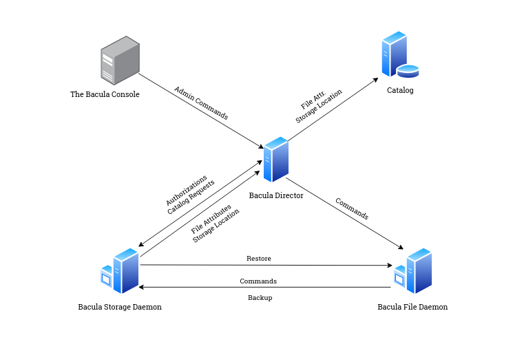
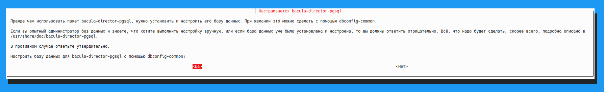

#### Bacula. Установка и настройка в операционной системе Debian Bookworm
`Bacula — это набор компьютерных программ, позволяющий системному администратору управлять резервным копированием, восстановлением и проверкой компьютерных данных в сети компьютеров разных типов. Bacula также может работать полностью на одном компьютере и может выполнять резервное копирование на различные типы носителей, включая ленту и диск.`
[Источник](https://www.bacula.org/what-is-bacula/)
#### Компоненты Bacula

  -  Bacula Director - центральная управляющая программа для всех остальных демонов. Он планирует и контролирует все операции резервного копирования, восстановления, проверки и архивирования. Системный администратор использует Bacula Director для планирования резервного копирования и восстановления файлов. Директор работает как демон (или служба) в фоновом режиме.
  -  The Bacula Console - это программа, которая позволяет администратору или пользователю общаться с Bacula Director. Он запускается в окне консоли (интерфейс TTY).
  -  Bacula File Daemon - это программа, которая должна быть установлена на каждом (клиентском) компьютере, для которого необходимо создать резервную копию. По запросу директора Bacula он находит файлы для резервного копирования и отправляет их (их данные) в демон хранения Bacula.
  -  Bacula Storage Daemon - По запросу от Bacula Director, Storage Daemon отвечает за прием данных от Bacula File Daemon и сохранение атрибутов и данных файла на физическом носителе или томах резервного копирования. В случае запроса на восстановление он отвечает за поиск данных и отправку их демону файлов Baacula. В вашей среде может быть несколько демонов Bacula Storage, каждый из которых контролируется одним и тем же директором Bacula. Службы хранилища работают как демон на компьютере с устройством резервного копирования (например, на ленточном накопителе).
  -  Catalog - Службы каталога состоят из программ, отвечающих за поддержание файловых индексов и баз данных томов для всех резервных копий файлов. Службы каталога позволяют системному администратору или пользователю быстро найти и восстановить любой нужный файл. Службы каталога устанавливают Bacula отдельно от простых программ резервного копирования, таких как tar и bru, поскольку в каталоге ведется запись всех используемых томов, всех выполненных заданий и всех сохраненных файлов, что обеспечивает эффективное восстановление и управление томами. В настоящее время Bacula поддерживает три разные базы данных: MySQL, PostgreSQL и SQLite, одну из которых необходимо выбрать при сборке Bacula.


#### Установка
_Bacula_, в отличие от _Bareos_ присутствует в стандартных репозиториях _Debian_, поэтому для установки воспользуемся пакетным менеджером _Apt_:
```
apt install bacula
```

> [!NOTE]
> При установке метапакета _Bacula_ устанавливаются следующий перечень пакетов: 
>
> `bacula-bscan bacula-client bacula-common bacula-common-pgsql bacula-console bacula-director bacula-director-pgsql bacula-fd bacula-sd bacula-server bsd-mailx dbconfig-common dbconfig-pgsql exim4-base exim4-config exim4-daemon-light libcommon-sense-perl
> libgnutls-dane0 libjson-perl libjson-xs-perl libllvm14 liblockfile1 libpq5 libtypes-serialiser-perl libunbound8 mt-st mtx postgresql postgresql-15 postgresql-client postgresql-client-15 postgresql-client-common postgresql-common sysstat`.
>
> По крайней мере, один пакет из данного списка, а имненно _bacula-director-pgsq_, потребует интерактивной настройки.



Чтобы избежать такого поведения, например, при автоматизированной установке, необходимо перед запуском `apt install` задать переменную **_DEBIAN_FRONTEND=noninteractive_** таким образом: `export DEBIAN_FRONTEND=noninteractive`. Тогда установщик при настройке _Bacula Catalog_ назначит параметры по умолчанию:
```# Generic catalog service
  Catalog {
  Name = MyCatalog
  dbname = "bacula"; DB Address = "localhost"; dbuser = "bacula"; dbpassword = "Password"
}
```
где __Password__ - произвольный пароль, созданный инсталлятором.

База данных для Bacula создается автоматически установщиком:
```
root@debian12:/etc/bacula# su postgres 
postgres@debian12:/etc/bacula$ psql -d bacula
psql (15.8 (Debian 15.8-0+deb12u1))
Введите "help", чтобы получить справку.

bacula=# \dt
               Список отношений
 Схема  |      Имя       |   Тип   | Владелец 
--------+----------------+---------+----------
 public | basefiles      | таблица | bacula
 public | cdimages       | таблица | bacula
 public | client         | таблица | bacula
 public | counters       | таблица | bacula
 public | device         | таблица | bacula
 public | file           | таблица | bacula
 public | filename       | таблица | bacula
 public | fileset        | таблица | bacula
 public | job            | таблица | bacula
 public | jobhisto       | таблица | bacula
 public | jobmedia       | таблица | bacula
 public | location       | таблица | bacula
 public | locationlog    | таблица | bacula
 public | log            | таблица | bacula
 public | media          | таблица | bacula
 public | mediatype      | таблица | bacula
 public | path           | таблица | bacula
 public | pathhierarchy  | таблица | bacula
 public | pathvisibility | таблица | bacula
 public | pool           | таблица | bacula
 public | restoreobject  | таблица | bacula
 public | snapshot       | таблица | bacula
 public | status         | таблица | bacula
 public | storage        | таблица | bacula
 public | unsavedfiles   | таблица | bacula
 public | version        | таблица | bacula
(26 строк)
```
Для того, чтобы пользователь (vagrant в данном случае) мог пользоваться графическим приложением Bacula Admin Tool - bat, добавим его в группу bacula. 
```
root@debian12:/etc/bacula# usermod -a -G bacula vagrant
```
